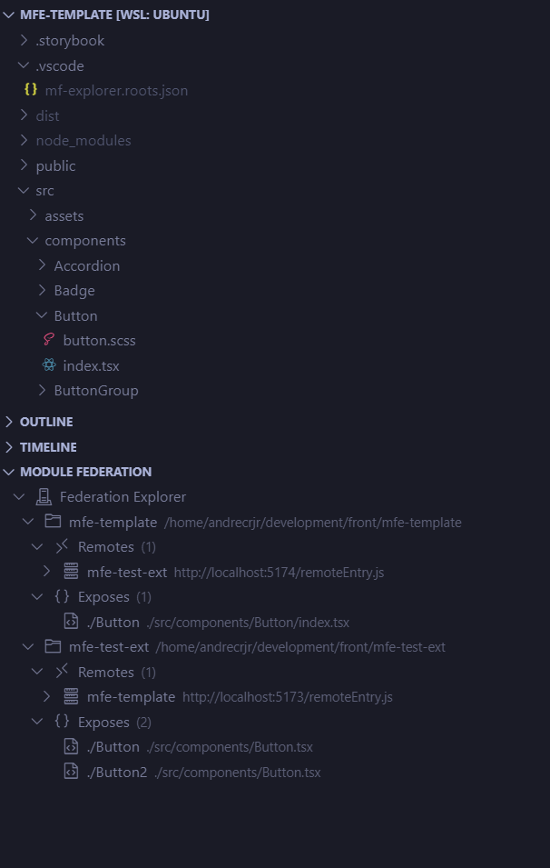
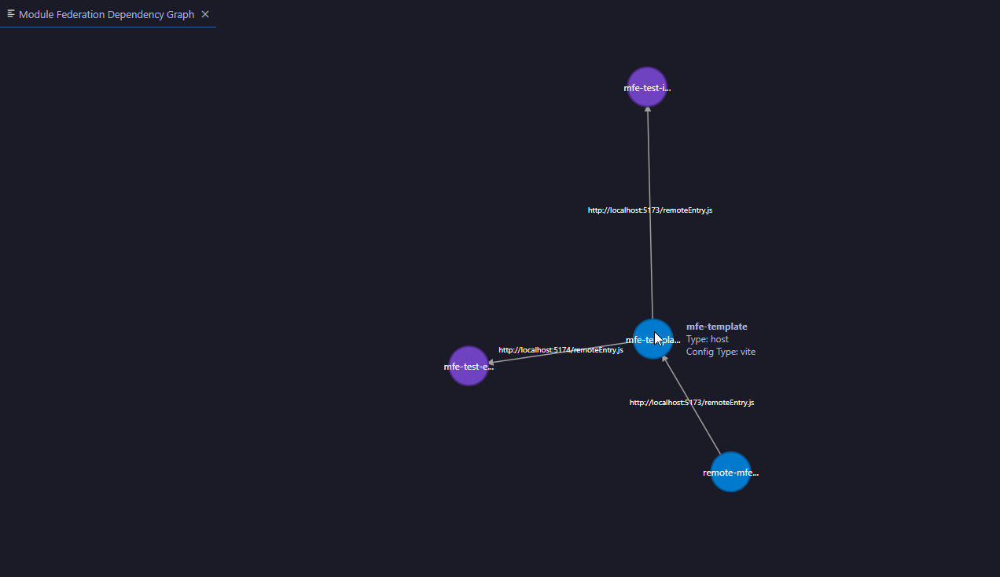

# Module Federation Explorer for Visual Studio Code

<div style="display:flex;width:100%;justify-content:center">

</div>

Module Federation Explorer gives you a living map of your local federation system inside VS Code. Discover hosts and remotes, inspect exposed modules and shared dependencies, and start the applications you need without jumping between project folders and terminals.

[Install Module Federation Explorer from the VS Code Marketplace](https://marketplace.visualstudio.com/items?itemName=acjr.mf-explorer)

[![DeepWiki](https://img.shields.io/badge/DeepWiki-andrecrjr%2Fmodule--federation--explorer-blue.svg?logo=data:image/png;base64,iVBORw0KGgoAAAANSUhEUgAAACwAAAAyCAYAAAAnWDnqAAAAAXNSR0IArs4c6QAAA05JREFUaEPtmUtyEzEQhtWTQyQLHNak2AB7ZnyXZMEjXMGeK/AIi+QuHrMnbChYY7MIh8g01fJoopFb0uhhEqqcbWTp06/uv1saEDv4O3n3dV60RfP947Mm9/SQc0ICFQgzfc4CYZoTPAswgSJCCUJUnAAoRHOAUOcATwbmVLWdGoH//PB8mnKqScAhsD0kYP3j/Yt5LPQe2KvcXmGvRHcDnpxfL2zOYJ1mFwrryWTz0advv1Ut4CJgf5uhDuDj5eUcAUoahrdY/56ebRWeraTjMt/00Sh3UDtjgHtQNHwcRGOC98BJEAEymycmYcWwOprTgcB6VZ5JK5TAJ+fXGLBm3FDAmn6oPPjR4rKCAoJCal2eAiQp2x0vxTPB3ALO2CRkwmDy5WohzBDwSEFKRwPbknEggCPB/imwrycgxX2NzoMCHhPkDwqYMr9tRcP5qNrMZHkVnOjRMWwLCcr8ohBVb1OMjxLwGCvjTikrsBOiA6fNyCrm8V1rP93iVPpwaE+gO0SsWmPiXB+jikdf6SizrT5qKasx5j8ABbHpFTx+vFXp9EnYQmLx02h1QTTrl6eDqxLnGjporxl3NL3agEvXdT0WmEost648sQOYAeJS9Q7bfUVoMGnjo4AZdUMQku50McDcMWcBPvr0SzbTAFDfvJqwLzgxwATnCgnp4wDl6Aa+Ax283gghmj+vj7feE2KBBRMW3FzOpLOADl0Isb5587h/U4gGvkt5v60Z1VLG8BhYjbzRwyQZemwAd6cCR5/XFWLYZRIMpX39AR0tjaGGiGzLVyhse5C9RKC6ai42ppWPKiBagOvaYk8lO7DajerabOZP46Lby5wKjw1HCRx7p9sVMOWGzb/vA1hwiWc6jm3MvQDTogQkiqIhJV0nBQBTU+3okKCFDy9WwferkHjtxib7t3xIUQtHxnIwtx4mpg26/HfwVNVDb4oI9RHmx5WGelRVlrtiw43zboCLaxv46AZeB3IlTkwouebTr1y2NjSpHz68WNFjHvupy3q8TFn3Hos2IAk4Ju5dCo8B3wP7VPr/FGaKiG+T+v+TQqIrOqMTL1VdWV1DdmcbO8KXBz6esmYWYKPwDL5b5FA1a0hwapHiom0r/cKaoqr+27/XcrS5UwSMbQAAAABJRU5ErkJggg==)](https://deepwiki.com/andrecrjr/module-federation-explorer)

## Why use it?

Module Federation projects are easy to understand one configuration file at a time—and surprisingly difficult to understand as a system. Hosts, remotes, exposed modules, shared dependencies, local folders, and start commands often live across several projects.

Module Federation Explorer brings that context into one VS Code view so you can:

- understand which applications consume which remotes;
- open exposed-module source files directly from the tree;
- see external remotes and shared dependencies in the same graph;
- onboard an unfamiliar workspace without manually finding every config file;
- start and stop host and remote development processes from integrated terminals.

## When it helps

Use it when you are:

- working on a multi-app or multi-root federation workspace;
- joining a project and need to understand its host/remote topology quickly;
- tracing an integration issue from a host to the remote or exposed module involved;
- checking which applications share dependencies;
- switching between local host and remote development sessions;
- combining workspace applications with remotes deployed somewhere else.

It is a local development companion, not a production runtime monitor. It reads supported configuration source, builds a normalized view, and manages the local commands you choose to run.

## See it in action

### Explore the federation tree

Browse configured hosts, their remotes, and exposed modules. Select an exposed module to open its source file.



### Understand the dependency graph

Open the graph to see consumes, exposes, shares, and bidirectional relationships. External remotes, shared dependencies, and exposed modules are represented separately so the shape of the system is easier to reason about.



The graph also supports reset view, physics on/off, export to JSON, node details, and opening a workspace application's configuration file.

## Quick start

### 1. Install and open a federation workspace

Install **Module Federation Explorer** from the [VS Code Marketplace](https://marketplace.visualstudio.com/items?itemName=acjr.mf-explorer), then open a workspace containing one or more supported federation projects.

### 2. Add projects to the Explorer

If no roots or explicit manifest sources are configured, the extension can scan the workspace and open onboarding. Select the projects you want to manage and import them as hosts or as remotes belonging to a host.

You can also configure projects manually:

1. Open the **Module Federation Explorer** view in the Explorer sidebar.
2. Choose **Change Configuration File** if you want a file other than the default `.vscode/mf-explorer.json`. Existing `.vscode/mf-explorer.roots.json` files are migrated automatically; the legacy file is left untouched.
3. Choose **Add New Host Folder** and select a folder containing a federation configuration.
4. Expand the host to inspect its remotes and exposed modules.

The extension does not automatically add every detected project as a root. This keeps the Explorer focused on the applications you choose, while onboarding can help you select and relate several projects at once.

### 3. Inspect and run the system

- Use **Show Dependency Graph** from the Explorer view toolbar to understand relationships.
- Use the host context actions to configure, start, or stop a host application.
- Use the remote context actions to configure its folder and commands, then start or stop it.
- Use **Add External Remote** when a host consumes a remote that is not available as a local workspace project.

## What it provides

### Workspace discovery

Scan configured root folders for supported Module Federation configuration files and `mf-manifest.json` artifacts. Discovery is de-duplicated, excludes `node_modules`, and keeps successful records available even when another file has a parse error.

### Tree exploration

Inspect hosts, remotes, exposed modules, source paths, remote URLs, configuration types, and running state in the VS Code Explorer view. Discovered manifests appear in a separate **Manifests** group with their source, environment, ID, diagnostics, and last-loaded timestamp. Root folders can be reordered by drag and drop.

### Dependency visualization

The graph makes these relationships visible:

- host and workspace-remote applications;
- external remotes with no matching workspace configuration;
- exposed-module nodes and `exposes` edges;
- shared-dependency nodes when a dependency is shared by more than one application;
- `consumes` edges, including bidirectional relationships.

### Local terminal workflows

- Hosts run in one integrated terminal.
- Remotes use one terminal for the build command and one for the preview/start command.
- The extension detects `npm`, `pnpm`, or `yarn` conventions and lets you edit folders and commands when project defaults are missing or outdated.
- Running indicators are cleaned up when terminals close or stale processes disappear.

### Live updates and persistence

The extension watches supported federation configuration files, `mf-manifest.json`, and both the current and legacy root configuration filenames. Changes are debounced for 500 ms before reloading. Root folders, host commands, remote folders, remote commands, external remotes, and explicit manifest sources are persisted in JSON; freshly discovered configuration and manifests remain separate from those saved settings.

## Supported configuration files

Discovery uses static AST analysis. It reads configuration source without executing project code.

| Configuration type | Files | Recognized shape |
| --- | --- | --- |
| Webpack | `webpack.config.js`, `webpack.config.ts` | `new ModuleFederationPlugin({ ... })` |
| Rspack | `rspack.config.js`, `rspack.config.ts` | `new ModuleFederationPlugin({ ... })` |
| Vite | `vite.config.js`, `vite.config.ts` | Federation plugin in the exported config |
| Rsbuild | `rsbuild.config.js`, `rsbuild.config.ts` | `moduleFederation.options` or a federation plugin |
| Modern.js | `module-federation.config.js`, `module-federation.config.ts`, `modern.config.js`, `modern.config.ts` | `createModuleFederationConfig({ ... })` |

The shared extractor reads `name`, `remotes`, `exposes`, and `shared` values. Literal values are preserved. Dynamic values are represented with placeholders such as `[ENV: env.REMOTE_URL]`, `[VAR: REMOTE_URL]`, `[FUNC: getUrl()]`, or `[DYNAMIC_URL]`; the extension never evaluates them.

## Root configuration

The default file is `.vscode/mf-explorer.json` in the first workspace folder. Root paths are stored as absolute, normalized paths. The legacy `.vscode/mf-explorer.roots.json` file is read only when the new file does not exist, then copied to the new filename without deleting or changing the legacy file. An explicitly selected custom configuration path always takes precedence.

Minimal configuration:

```json
{
  "roots": ["/workspace/host"]
}
```

Manifest sources can be discovered automatically below `roots` and can also be registered explicitly. Local locations are resolved from the workspace root; URL sources must use `http` or `https`.

```json
{
  "roots": ["/workspace/host"],
  "manifestSources": [
    {
      "kind": "local",
      "location": "apps/catalog/mf-manifest.json",
      "environment": "local"
    },
    {
      "kind": "url",
      "location": "https://staging.example.test/mf-manifest.json",
      "environment": "staging"
    }
  ]
}
```

Manifest JSON is parsed as data only. The extension does not execute configuration files or `remoteEntry.js`; malformed sources produce diagnostics while valid manifests remain available. Manifest records carry `provenance: "manifest"`, while static AST records carry `provenance: "static"`.

Optional per-root settings store host commands, local remote overrides, and external remotes:

```json
{
  "roots": ["/workspace/host"],
  "rootConfigs": {
    "/workspace/host": {
      "startCommand": "pnpm run dev",
      "remotes": {
        "auth": {
          "name": "auth",
          "folder": "../auth",
          "packageManager": "pnpm",
          "configType": "vite",
          "buildCommand": "pnpm run build",
          "startCommand": "pnpm run preview"
        }
      },
      "externalRemotes": {
        "catalog": {
          "name": "catalog",
          "url": "https://example.test/catalog/remoteEntry.js",
          "configType": "external",
          "isExternal": true
        }
      }
    }
  }
}
```

Discovered federation data and saved user settings are separate. On reload, saved remote folders and commands are overlaid onto a fresh discovery result. External remotes exist only in the saved root configuration and are added during hydration.

## Common workflows

### Hosts

- Add or remove root folders from the Explorer toolbar or context menu.
- Configure a host start command; the extension suggests a command from the detected lockfile and bundler conventions.
- Start or stop a host application in one integrated terminal.
- Drag root folders to change their persisted order.

### Remotes

- Start a configured remote with separate build and preview/start terminals.
- Configure the remote project folder, build command, or preview command when values are missing or outdated.
- Stop a running remote from the tree.
- Add an external remote by name and URL. External remotes are persisted under their owning host and are not parsed from a local project.

### Graph

The graph is derived from the current configurations. Click a workspace application node to view details or open its configuration file. The bundled D3.js file is used first, with CDN fallbacks available if needed.

## Important boundaries and troubleshooting

- **The tree is empty:** add a host folder, or wait for onboarding to detect supported projects. Detected projects are suggestions; they are not all added automatically.
- **A configuration is not recognized:** confirm the filename and recognized shape in the support table. The extension reads source statically and does not run arbitrary configuration code.
- **A URL or path shows a placeholder:** the value is dynamic. Placeholders are intentional because the extension does not evaluate environment variables, functions, or other runtime expressions.
- **A local remote cannot be started:** configure a valid project folder and its build/start commands. External remotes are represented by their URL and are not started as local processes.
- **A file has a parse problem:** the affected file produces a diagnostic, while valid configurations from other roots can still load.
- **A manifest cannot be loaded:** check its local path or URL and inspect the output diagnostics. HTTP(S) loading is bounded, does not send cookies or authorization headers, and rejects oversized responses.

## Commands

Most actions are available from the Explorer view toolbar, the host/remote context menus, or the command palette.

| Area | User-facing actions |
| --- | --- |
| Explorer | Refresh, show/focus/open the view, show the welcome page |
| Hosts | Add/remove host folder, change configuration file, configure/edit/start/stop host |
| Remotes | Edit remote folder or commands, start/stop remote, add/remove external remote |
| Graph | Show dependency graph, reset or export the graph from the graph panel |

The contributed command IDs and menu conditions are maintained in [`package.json`](package.json).

## Requirements

- Visual Studio Code 1.80 or newer.
- Node.js and a package manager (`npm`, `pnpm`, or `yarn`) for projects managed by the extension.
- A workspace containing supported Module Federation configuration files.

Node.js 24 is used for repository development and CI. The extension itself runs inside the VS Code extension host.

## Development

```bash
make setup
make check
```

Useful Make targets:

| Target | Purpose |
| --- | --- |
| `make setup` | Install locked dependencies |
| `make run` | Launch the VS Code Extension Development Host |
| `make watch` | Rebuild the extension bundle on changes |
| `make format` | Format supported files with Oxfmt |
| `make format-check` | Check formatting without writing files |
| `make lint` | Run Oxlint |
| `make check` | Run formatting, lint, typecheck, and headless tests |
| `make vsce` | Build and package a `.vsix` with VSCE |
| `make install` | Install the generated `.vsix` in VS Code |

Equivalent npm scripts include:

```bash
npm run format
npm run format:check
npm run watch
npm run lint
npm run typecheck
npm run compile
npm run package
npm run clean:test
npm run test:headless
npm run test:coverage
npm run test:manual
npm run test:ui
npm run test:ui:headless
npm run vsce
```

Desktop UI tests use VS Code Extension Tester and need a graphical display. On headless Linux, use `npm run test:ui:headless`.

`make package` is kept as an alias for `make vsce`. The generated `.vsix` can be installed with `make install` or through the VS Code Extensions view.

### Measure extension startup

The performance benchmark compares two Git refs in clean VS Code test hosts. It reports median and p95 timings for activation return, static-tree readiness, complete application data, registration milestones, runner time, and compile time. It uses an external tree-provider probe, so `master` does not need the refactor’s test or instrumentation files.

```bash
rtk npm run perf:extension -- --base master --head feature/refactoring --runs 5 --mode cold,warm
```

Run `npm run test:performance-cli` to test the report parser and statistics helpers.

## Documentation map

- [`docs/architecture.md`](docs/architecture.md): runtime architecture, boundaries, data flow, and extension points.
- [`AGENTS.md`](AGENTS.md): repository guidance for coding agents.
- [`roadmap.md`](roadmap.md): active product and technical backlog.

## Contributing

Pull requests are welcome. Keep changes focused, preserve strict TypeScript boundaries, add or update tests for behavior changes, and use Conventional Commits (`feat:`, `fix:`, `docs:`, `test:`, `chore:`). See the architecture and agent guides before changing cross-feature behavior.

## Support and license

If this extension improves your Module Federation workflow, support the project on [Ko-fi](https://ko-fi.com/andrecrjr).

Released under the MIT License. See [`LICENSE.md`](LICENSE.md).
