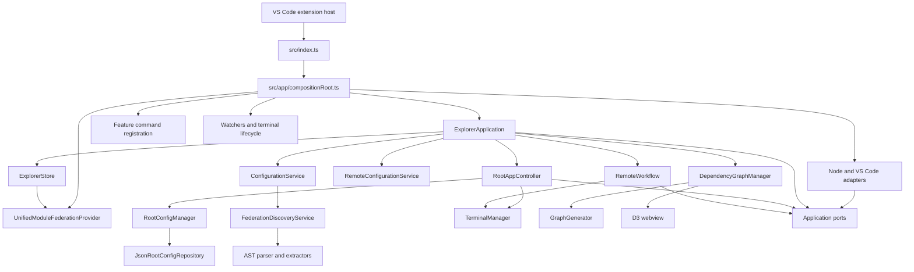

# Module Federation Explorer architecture

This document describes architecture present in source today. Use it with [`AGENTS.md`](../AGENTS.md) when changing code. `README.md` covers user workflows; this document covers ownership, data flow, and extension seams.

## Design shape

Extension uses feature-first structure with one composition boundary:



`src/index.ts` is intentionally thin: it re-exports `activate` from `src/app/compositionRoot.ts`. `compositionRoot.ts` is the place where concrete services are created and VS Code resources are registered. Business workflows live behind `ExplorerApplication` and feature services.

## Source layout

```text
src/
├── index.ts                         extension entry point
├── app/
│   ├── compositionRoot.ts           composition, activation, adapter wiring
│   ├── explorerApplication.ts       application coordinator and façade
│   ├── ports.ts                     dependency inversion boundaries
│   ├── registerCommands.ts          command composition
│   ├── registerWatchers.ts          config-file watchers and reload debounce
│   ├── lifecycle.ts                 onboarding and terminal lifecycle
│   └── welcome.ts                   welcome webview
├── federation/
│   └── configFileRegistry.ts        supported file patterns and discovery
├── parser/                          AST parsing, traversal, dynamic expressions
├── extractors/                      bundler-specific federation extraction
├── features/
│   ├── explorer/                    store, tree model, provider, tree commands
│   ├── roots/                       root persistence and host workflow
│   ├── remotes/                     remote persistence and remote workflow
│   └── graph/                       graph model, generator, webview, commands
├── infrastructure/
│   ├── node/                        filesystem, paths, package manager, JSON repo
│   └── vscode/                      dialogs, output channel, terminals
├── types.ts                         federation and root domain models
├── configurationService.ts           discovery façade and remote enrichment
├── workspaceScanner.ts               onboarding adapter over shared discovery
├── onboarding.ts                     onboarding webview (transitional)
└── ratingPrompt.ts                   feedback state (transitional)
```

Graph-specific types live in `src/features/graph/types.ts`. Federation and root models remain in `src/types.ts`; splitting those models is tracked in `todo-refactor.md`.

## Dependency direction

Dependencies point inward toward application contracts and domain models:

```text
VS Code / Node APIs
        ↓
infrastructure adapters + UI boundaries
        ↓
application ports and feature workflows
        ↓
parser, extractors, graph generator, schemas, domain models
```

Rules:

- `ExplorerApplication` coordinates workflows; it does not render tree items or own VS Code widget details.
- Application workflows depend on interfaces from `src/app/ports.ts`, not on `vscode`, `fs`, or a global output channel.
- `GraphGenerator`, parser utilities, extractors, root schema validation, and path utilities stay deterministic and testable without launching VS Code.
- `UnifiedModuleFederationProvider` is a VS Code tree/drag-and-drop adapter. It subscribes to `ExplorerStore`; it does not load files, persist settings, start terminals, or build graphs.
- `DependencyGraphManager` is the graph UI coordinator. Graph derivation belongs in the pure `GraphGenerator`.
- `compositionRoot.ts` creates concrete adapters and owns activation-time registration.
- Every disposable resource created during activation is registered with `ExtensionContext.subscriptions` or owned by a registered disposable.

The architecture-boundary test guards removal of deprecated top-level compatibility modules. Import direction is also documented here and should remain enforced by review until a dedicated dependency check exists.

## Activation and application lifecycle

### Activation

Manifest activation events in `package.json` cover supported config filenames and `.vscode/mf-explorer.roots.json`. `activate()` then:

1. creates `ExplorerStore`, `ExplorerApplication`, and `UnifiedModuleFederationProvider`;
2. registers the tree data provider and drag/drop tree view;
3. registers explorer, root, remote, and graph command modules;
4. registers configuration watchers;
5. registers terminal close handling and periodic cleanup;
6. schedules delayed onboarding detection;
7. initializes rating state;
8. starts `application.initialize()` without blocking activation on the first load.

On activation, running-terminal bookkeeping is cleared. VS Code terminals that close later are removed from runtime state, and a ten-second cleanup interval removes entries whose process is no longer alive.

### Initialization

`ExplorerApplication.initialize()` checks `RootConfigManager.hasConfiguredRoots()`:

- roots configured → load and hydrate configurations;
- no roots configured → leave the store empty and wait for user setup/onboarding.

After 1.5 seconds, `scheduleOnboarding()` checks again. If roots are still absent, `workspaceScanner.ts` runs the same `FederationDiscoveryService` used by normal loading and passes detected projects to the onboarding webview.

### Configuration reload

`ExplorerApplication.loadConfigurations()` is the main reload transaction:

```text
RootConfigManager.loadRootConfig()
  → read configured roots
  → ConfigurationService.load(root paths)
  → store discovered configs
  → RootAppController root presentation state
  → RemoteConfigurationService.hydrateRemoteConfigurations()
  → store hydrated configs
  → build root-folder presentation state
  → refresh open dependency graph
```

`ExplorerStore.isLoading` prevents overlapping loads. If a reload arrives while loading, `reloadQueued` causes one follow-up load after the current transaction. Parse failures are logged per file while successful files remain available.

`registerWatchers.ts` watches:

- `**/{webpack,vite,rsbuild,rspack}.config.{js,ts}`;
- `**/module-federation.config.{js,ts}`;
- `**/.vscode/mf-explorer.roots.json`.

Create, change, and delete events use one 500 ms debounce before calling `reloadConfigurations()`.

## Federation discovery and parsing

`src/federation/configFileRegistry.ts` is the single registry for supported file patterns and extractors:

| Type | Files | Extractor recognition |
| --- | --- | --- |
| `webpack` | `webpack.config.js`, `webpack.config.ts` | `new ModuleFederationPlugin({ ... })` |
| `rspack` | `rspack.config.js`, `rspack.config.ts` | same plugin shape, returned as `configType: 'rspack'` |
| `vite` | `vite.config.js`, `vite.config.ts` | federation plugin in exported config; imported aliases supported |
| `rsbuild` | `rsbuild.config.js`, `rsbuild.config.ts` | `moduleFederation.options` or federation plugin |
| `modernjs` | `module-federation.config.js`, `module-federation.config.ts`, `modern.config.js`, `modern.config.ts` | `createModuleFederationConfig({ ... })` |

Discovery flow:

```text
configured root paths
  → vscode.workspace.findFiles for every registry definition
  → exclude node_modules
  → de-duplicate overlapping file matches
  → parseConfigFile(file, extractor)
  → keep only configs with detected === true
  → collect per-file ParseDiagnostic errors
  → group configurations by configured root path
```

`ConfigurationService` enriches each discovered remote using `detectPackageManagerAndStartCommand()`, adds `configPath` to the config, and records `configSource` on remotes and exposed modules. Vite and Rsbuild default to `dev`; Webpack, Rspack, and Modern.js default to `start`. Users can override commands later.

### Static AST behavior

`parseConfigFile.ts` uses `@typescript-eslint/parser` with module syntax, latest ECMAScript syntax, source locations, and ranges. It does not execute project configuration files. Supporting helpers:

- `astUtils.ts`: typed node checks, property lookup, identifier/member names, and safe AST walking;
- `expressionResolver.ts`: literal, identifier, member, template, call, conditional, and other dynamic string representations;
- `extractors/configObject.ts`: resolves common identifier, wrapper-function, conditional, logical, and sequence-expression config shapes;
- `extractors/shared.ts`: common extraction of name, remotes, exposes, and shared dependencies.

Dynamic values remain explicit placeholders, for example `[ENV: env.REMOTE_URL]`, `[VAR: REMOTE_URL]`, `[FUNC: getUrl()]`, or `[DYNAMIC_URL]`. Invalid source or extractor failures become `ConfigParseError` objects with file, severity, line, and column data.

## State and persistence

State has deliberate ownership:

| State | Owner | Lifetime |
| --- | --- | --- |
| Root path and saved settings | `UnifiedRootConfig` through `RootConfigManager` and `JsonRootConfigRepository` | persisted JSON |
| Discovered federation configs | `ExplorerStore.configs` | in-memory; rebuilt on reload |
| Root tree presentation | `ExplorerStore.rootFolders` | in-memory derived state |
| Loading status | `ExplorerStore.isLoading` | in-memory transaction state |
| Remote/host running status | `TerminalManager` | transient VS Code session state |
| Dependency graph | `GraphGenerator` result | derived from current configs |

### Root configuration file

`RootConfigManager` defaults to `.vscode/mf-explorer.roots.json` in the first workspace folder. The selected path is stored in VS Code `workspaceState` under `mf-explorer.configPath`. The manager owns user prompts and workflow behavior; `rootConfigSchema.ts` owns pure validation and migration; `JsonRootConfigRepository` owns filesystem JSON I/O.

Current schema:

```json
{
  "roots": ["/workspace/host"],
  "rootConfigs": {
    "/workspace/host": {
      "startCommand": "pnpm run dev",
      "remotes": {
        "auth": {
          "name": "auth",
          "folder": "../auth",
          "packageManager": "pnpm",
          "configType": "vite",
          "buildCommand": "pnpm run build",
          "startCommand": "pnpm run preview"
        }
      },
      "externalRemotes": {
        "catalog": {
          "name": "catalog",
          "url": "https://example.test/catalog/remoteEntry.js",
          "configType": "external",
          "isExternal": true
        }
      }
    }
  }
}
```

Legacy `{ "paths": [...] }` and `{ "directories": [...] }` shapes are migrated to `{ "roots": [...] }`. Root paths are compared with normalized absolute paths. `findContainingRoot()` avoids unsafe string-prefix matches when associating remotes with roots.

### Remote hydration

Discovery gives each remote defaults from source. `RemoteConfigurationService` then:

1. finds the saved root entry using normalized paths;
2. clones discovered configs;
3. overlays saved folder, URL, package manager, build, and start settings;
4. adds saved external remotes;
5. returns a new map for `ExplorerStore`.

This keeps user-managed runtime settings from being mistaken for source configuration. Remote folder resolution accepts absolute paths and searches configured roots for relative paths. External remote settings contain URL/name data only and have `configType: 'external'`.

## Explorer feature

`ExplorerStore` is a small observable state container. It publishes snapshots containing configs, root folders, and loading state. The provider subscribes and fires `onDidChangeTreeData` when the store changes.

Tree hierarchy:

```text
root folder
├── Remotes (n)
│   └── remote
│       └── exposed module(s) from matching remote config
└── Exposed Modules (n)
    └── exposed module
```

`treeModel.ts` derives root children and remote-exposed modules. `treeItemFactory.ts` maps domain/presentation elements to VS Code `TreeItem`s, tooltips, icons, context values, and open-file commands. Root folders support drag/drop reordering; the application persists the new root order.

Command handlers are split by feature:

- `features/explorer/registerCommands.ts`: view focus, welcome, feedback, rating, refresh;
- `features/roots/registerCommands.ts`: root and host actions;
- `features/remotes/registerCommands.ts`: remote and external-remote actions;
- `features/graph/registerCommands.ts`: graph display and terminal cleanup.

Each handler validates tree arguments before delegating to `ExplorerApplication`.

## Host, remote, and terminal workflows

### Root/host workflow

`RootAppController` handles adding/removing roots, changing the root configuration file, configuring host commands, changing host folders, and starting/stopping host apps. It uses `RootConfigService`, dialogs, package-manager detection, and `TerminalPort` through injected dependencies.

### Remote workflow

`ExplorerApplication.startRemote()` handles the start path because it needs application-level access to the store and terminal state. It:

1. asks for a project folder when the remote is not configured or its folder disappeared;
2. detects a package manager when needed;
3. prompts for build and preview/start commands when missing;
4. saves remote overrides;
5. starts the remote through `TerminalManager` using a stable `remote-${name}` key;
6. refreshes tree state and reports success.

`RemoteWorkflow` owns remote command editing and add/remove external-remote flows. `RemoteConfigurationService` owns persistence and root association.

`TerminalManager` creates:

- one terminal for a host app, running its configured start command;
- one build terminal and one preview/start terminal for a remote.

It tracks these terminals, stops/disposes them, handles VS Code close events, and removes disposed entries during periodic cleanup. Running state is not persisted.

## Dependency graph feature

`GraphGenerator.generate()` is a pure six-pass transformation from `Map<string, ModuleFederationConfig[]>` to `DependencyGraph` plus diagnostics:

1. analyze application capabilities (host, remote, bidirectional, standalone);
2. map remote consumption and create external-remote nodes for unmatched names;
3. create unified application nodes;
4. create consolidated `consumes` edges;
5. create exposed-module nodes and `exposes` edges;
6. create shared-dependency nodes and `shares` edges.

Application IDs combine hashes of root/config paths, app name, and config type. Remote matching is exact first, then case-insensitive. Ambiguous case-insensitive matches produce a diagnostic and are not linked. Self-references are skipped with a warning. Shared dependency nodes appear only when a dependency is present in more than one application; `[DYNAMIC_SHARED]` is not collapsed into a shared node.

`DependencyGraphManager` owns the panel lifecycle and delegates HTML generation/message handling. `webview/template.ts` converts `from`/`to` edges into D3 `source`/`target` links, serializes data safely for a script element, and loads bundled D3 before CDN fallbacks. `webview/handlers.ts` validates `error`, `loaded`, and `nodeClick` messages before handling them. Workspace app nodes can open their associated config file.

## Onboarding, welcome, and feedback

These modules remain outside `features/` and are known transitional seams:

- `src/onboarding.ts` renders the setup webview, reuses shared discovery, writes selected roots/settings through `ExplorerApplication`, and reloads the store;
- `src/app/welcome.ts` renders the welcome webview and routes buttons to VS Code commands/external links;
- `src/ratingPrompt.ts` stores global rating state and tracks onboarding/remote-start success events.

Future extraction should preserve the application boundary and webview message validation rather than adding business logic to UI handlers.

## Testing architecture

Tests mirror behavior and boundaries:

- parser/extractor/discovery tests: `src/test/federationPipeline.test.ts`, `parserExpressions.test.ts`, `configurationService.test.ts`;
- application/store/workflow tests: `explorerApplication.test.ts`, `explorerStore.test.ts`, `root*`, `remote*`, `packageManager.test.ts`;
- tree tests: `treeModel.test.ts`, `treeItemFactory.test.ts`, `unifiedTreeProvider.test.ts`;
- graph/webview tests: `src/test/graph/` and `webviewSecurity.test.ts`;
- lifecycle/terminal/registration tests: `lifecycle.test.ts`, `terminalManager.test.ts`, `commandRegistration.test.ts`;
- manual extension-host flow: `manualFlows.integrationTest.ts`;
- desktop UI fixtures: `src/ui-test/` with configured and onboarding workspaces.

Use injected ports and pure helpers for fast tests. Use extension-host or desktop suites only when behavior depends on VS Code runtime APIs.

## Build and validation

Rspack uses `src/index.ts` as entry and emits `dist/extension.js`; `vscode` remains an external supplied by VS Code. TypeScript test projects compile production tests to `out/`.

Common checks:

```bash
npm run typecheck
npm run lint
npm run compile
npm run test:headless
npm run test:coverage
npm run test:ui:headless
```

CI runs these checks on Node.js 22. Desktop tests target VS Code 1.135.0 and require a display unless run through the headless wrapper.

## Extension points and remaining work

When adding a bundler, update the registry, extractor, activation events, watcher pattern, tests, and user documentation. When adding a command, update `COMMAND_IDS`, the owning feature registrar, manifest contributions/menu conditions, type guards, tests, and README.

Remaining architectural work is tracked in `todo-refactor.md`, including moving onboarding/feedback into feature folders, splitting shared models, and organizing tests into more explicit unit/integration trees. Do not treat its historical target layout as current source layout.
